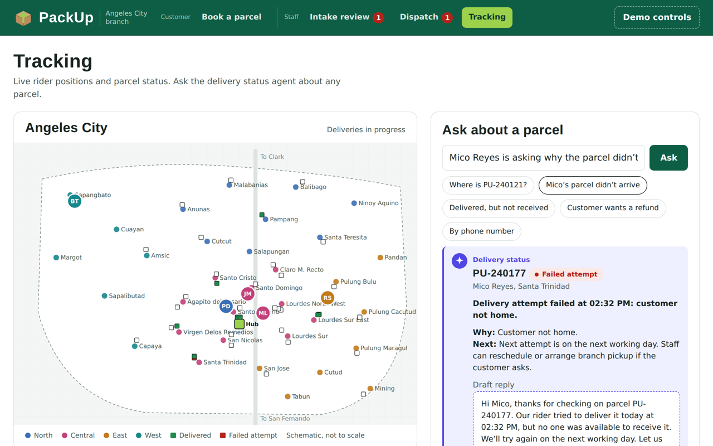

# PackUp

An interactive prototype of an AI-first courier operations platform: three agents covering intake, rider assignment and delivery status, with a person in the loop at every step.

**Live demo:** https://jlmdr.github.io/packup/



## What it does

| Screen | Who uses it | What happens |
| --- | --- | --- |
| Book a parcel | Customers online, staff at the counter | Form rules (city and barangay from dropdowns, fee from the rate table), then the intake agent fills and cross-checks the address, checks items and duplicates, writes a rider note, and answers booking questions |
| Intake review | Intake staff | Bookings the agent couldn't confirm, fixed before dispatch |
| Dispatch | Dispatchers | The rider assignment agent drafts the morning plan for local parcels, flagged parcels first; the dispatcher approves. Parcels for other cities are handed to the hub |
| Tracking | Tracking team | Live rider map, plus the delivery status agent answering "where's my parcel?" with a draft reply |
| Demo controls | Presenter | Stand-in for a rider app: mark delivered, report a failed attempt, mark a rider absent |

## Try it in five minutes

1. **Book a parcel:** tap the "Landmark in Filipino", "Barangay mismatch" and "Which Dolores?" examples, then "Sending to Manila". Ask the help box "How much for 4 kg to Cebu?".
2. **Intake review:** confirm the flagged booking.
3. **Dispatch:** run the morning assignment, review the flagged parcels, approve, and start deliveries.
4. **Demo controls:** report a failed attempt for a rider.
5. **Tracking:** ask the delivery status agent about that parcel.

## Run it locally

The code uses ES modules, which browsers only load from a web server.

```bash
npm start                    # http://localhost:3000
# or, without Node:
python3 -m http.server 3000
```

No install, no build step and no API keys.

### Live AI (optional)

The agents run simulated by default. The code is wired for a live model through a small backend proxy, with tools and guardrails per agent and automatic fallback to the simulation:

```bash
npm run start:mock     # check the wiring without credentials
npm run start:live     # Amazon Bedrock; see docs/ai-integration.md
```

Then open `http://localhost:8787/?ai=live`.

## How it's built

Plain HTML, CSS and JavaScript modules, with no framework. Screens ask the agent gateway for every decision; it answers with the simulated agents or a live model, in the same shape either way.

```
css/          base.css (tokens, reset), layout.css (page shell), components.css (shared UI), screens.css (per screen)
js/data/      sample Angeles City data: barangays, riders, parcels, rates, item policy
js/core/      store (system of record), validation rules, rider simulation
js/tools/     typed tools: the only way agents read data
js/agents/    gateway (index.js), simulated agents, and live-model specs (specs.js)
js/ai/        model client, tool registry, live agent runner, output schema checks
js/ui/        one module per screen, plus the map and demo controls
server/       optional backend proxy for live AI (Bedrock and mock providers)
```

Screens read records through the store and read-only tools, and get every decision from the agent gateway. Agents, simulated or live, see data only through tools.

More detail: [docs/agents.md](docs/agents.md), [docs/architecture.md](docs/architecture.md) and [docs/ai-integration.md](docs/ai-integration.md).

## Notes

- All names, phone numbers and addresses are fictional.
- Cities, barangays, riders and parcels are sample data. The riders and map use one sample delivery area (Angeles City's barangays, drawn as a schematic, not to scale); parcels for other cities go to the hub.
- Rates are modelled on published Philippine courier rates and shown for reference only.
