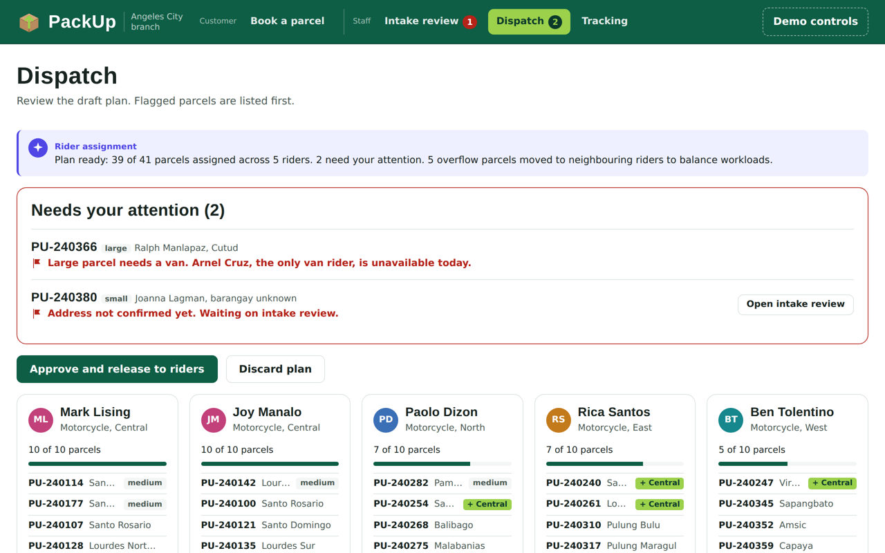

# Agents

Each agent makes judgement calls; fixed rules stay in plain software (`js/core/validation.js`). Agents read data only through the tools in `js/tools/`.

## Intake agent (`js/agents/intake.js`, `js/agents/booking-help.js`)

Runs live on the booking form. Rules come first (`js/core/validation.js`, `js/core/pricing.js`): names, 11-digit mobile numbers, a required street, city and barangay chosen from dropdowns, weight vs size, and the fee from the rate table. The agent handles the judgement calls on top.

| Check | What it decides |
| --- | --- |
| Place from text | Fills the city and barangay from the street or landmark, including Filipino phrases ("tapat ng Marquee Mall" → Pulung Maragul, Angeles City), and asks when names clash ("Dolores" in two cities, three "Lourdes" in one) |
| Mismatch | Asks when the address text points to a different city or barangay than the one selected |
| Past deliveries | Suggests a returning recipient's last successful address, filling all three fields in one tap |
| Item | Blocks items that can't be carried; adds handling notes for batteries, liquids, food and fragile items |
| Duplicate | Asks before booking the same recipient and address twice in a day |
| Rider note | Combines address, translated landmark, details like "blue gate", and handling into one instruction |

**Booking help:** a "Need help?" box answers booking questions (items, rates by destination, where we deliver, "what's my barangay?") and can fill the city and barangay into the form. Refunds, complaints and parcels already sent are redirected to staff.

**Human checkpoint:** a booking can't be made without a city and barangay, and is blocked only when the address is too thin to deliver. Risky addresses (a kept mismatch, or a new address that differs from past deliveries) still book and go to intake review.

## Rider assignment agent (`js/agents/assignment.js`)

Builds the morning plan in one batch.

- **Inputs:** barangay and area, parcel size, rider area, vehicle, workload and availability
- **Batch:** parcels for the riders' delivery area; parcels for other cities go to the hub instead
- **Decisions:** match parcels to area riders and suitable vehicles, balance overflow to neighbouring areas, flag what can't be assigned (for example, a large parcel when the only van rider is on leave)
- **Human checkpoint:** the dispatcher reviews flagged parcels first, then approves before anything is released

Route order is deliberately out of scope: it is an optimization problem, better handled by routing software than an LLM.

## Delivery status agent (`js/agents/delivery-status.js`)

Answers staff questions about a parcel.

- **Finds** the parcel by reference code, phone number or recipient name in free text
- **Summarizes** its status and the rider's current location, and drafts a reply
- **Explains** failed attempts and the next step
- **Escalates** money or policy requests, disputed deliveries and complaints to a supervisor, with no draft

It is read-only: no tool it can call changes a booking. There is no arrival estimate, since "out for delivery" already means today.
